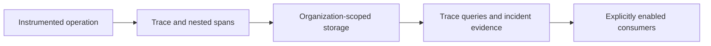

# AI Trace

### Follow an AI workflow from its first span to its last side effect.

An LLM response is only one piece of an agent's execution. AI Trace explores how to connect nested model calls, background work, costs, errors, and incident records without turning observability into a store of sensitive prompts.

Built with **Python, FastAPI, PostgreSQL, SQLAlchemy, and Celery**, it combines trace primitives with organization-scoped storage and explicit controls over provider execution and prompt capture.

**Start with:** [trace context](src/tracing/context.py) · [decorators](src/tracing/decorators.py) · [storage](src/tracing/storage/postgres.py) · [privacy tests](tests/unit/test_sensitive_trace_authorization.py)

## What to look at

| Engineering question | Implementation |
| --- | --- |
| How does context survive nested async calls and queued work? | Immutable trace context, Python `contextvars`, and serializable correlation metadata in [`src/tracing/`](src/tracing/). |
| How are observations connected to a tenant? | Organization-aware trace queries and persistence in [`storage/postgres.py`](src/tracing/storage/postgres.py). |
| Can useful error evidence survive without raw prompts? | Capture controls, safe error codes, and reasoning redaction, covered by [provider governance](tests/unit/test_provider_execution_governance.py) and [reasoning tests](tests/unit/test_reasoning_redaction.py). |
| How do notifications recover from retries? | Durable claims, expiration recovery, and idempotency identifiers in the [notification outbox](src/services/notification_outbox.py). |



Provider calls, scheduling, notifications, and runtime controls require their own explicit configuration. The trace model is not proof that a downstream runtime applied an action.

## Explore locally

Requires **Python 3.11+**. The focused tracing tests use controlled fixtures; they do not require live provider credentials.

```bash
git clone https://github.com/asquitt/agent-trace.git
cd agent-trace
python3 -m venv .venv
source .venv/bin/activate
python -m pip install -e '.[dev]'
python -m pytest tests/unit/test_tracing.py tests/unit/test_tracing_decorators.py -q
```

Read [`tests/unit/`](tests/unit/) for smaller examples of context propagation, error handling, privacy checks, and runtime-control boundaries. Database integration tests require a separately configured test database.

## Privacy and execution boundaries

`PROVIDER_EXECUTION_ENABLED=false` blocks traced provider requests, and `TRACE_CAPTURE_PROMPTS=false` disables capture of prompt-bearing details for new calls. Existing stored data still needs its own retention and redaction review. Sensitive detail requests require tenant authorization and explicit access checks.

The [local evaluation guide](docs/LOCAL_EVALUATION.md) documents prompt handling, provider-gate rollback, migration defaults, and maintenance contracts. Read it before connecting credentials, databases, or external consumers. Public source availability does not establish hosted service availability or end-to-end enforcement.

## Repository map

- [`src/tracing/`](src/tracing/): context, decorators, spans, provider wrappers, and persistence.
- [`src/api/`](src/api/): trace queries and operation endpoints.
- [`src/services/`](src/services/): incident, notification, and runtime-control logic.
- [`alembic/`](alembic/): database migrations.
- [`tests/`](tests/): focused unit and integration contracts.

## Discuss or contribute

Useful discussion areas include async context propagation, privacy-preserving telemetry, outbox delivery semantics, and debugging AI workflows across queues. A minimal failing trace or focused regression test makes a great starting point.

Built by [Demario Asquitt](https://github.com/asquitt). [More projects](https://github.com/asquitt#selected-work).
